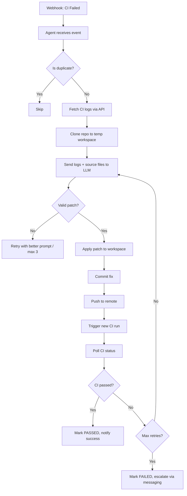

# CI Review Agent — Product & Technical Documentation

## 1. Product Vision

The CI Review Agent is an **autonomous, self-healing CI/CD agent** that:
- Listens for CI failures across GitHub Actions and Forgejo/Gitea
- Automatically diagnoses root causes using LLMs
- Applies code fixes and pushes them back to trigger re-CI
- Retries automatically up to a configured limit
- Escalates to human engineers via Mattermost/Slack/Discord when retries are exhausted
- Provides a real-time dashboard for visibility into all CI activity

### Target Market
- Engineering teams using self-hosted Git platforms (Forgejo/Gitea, GitHub Enterprise)
- DevOps teams tired of manual CI triage
- Organizations wanting to reduce MTTR (Mean Time To Resolution) for broken builds
- Anyone running CI/CD pipelines that fail frequently due to common, fixable issues

---

## 2. Current State Assessment

### ✅ What Is Working

| Component | Status | Details |
|-----------|--------|---------|
| **Forgejo Instance** | ✅ Running | Built from fork at `/home/darshan.parmar/Desktop/forgejo`, running on `localhost:3000` |
| **Self-Hosted Runner** | ✅ Running | Docker container `forgejo-runner` registered and online |
| **Agent Web Server** | ✅ Running | FastAPI server on `localhost:8000` with health checks |
| **Webhook Delivery** | ✅ Working | Forgejo sends `push` and `action_run_*` events to agent |
| **Webhook Signature Verification** | ✅ Working | HMAC-SHA256 verification active |
| **Persistent Run Storage** | ✅ Working | SQLite-backed `.ci_runs.db` with TTL expiry |
| **Background CI Poller** | ✅ Working | Reconciling active runs with actual Forgejo CI status every 30s |
| **Dashboard** | ✅ Working | Real-time HTMX dashboard with live metrics and run history |
| **LLM Integration** | ✅ Working | Google Gemini integrated and responding |
| **LangGraph Agent Loop** | ✅ Working | Graph executes nodes: fetch_logs → analyze → apply → poll |
| **Run History** | ✅ Persisting | Stored in SQLite, survives restarts |

### ❌ What Is NOT Working

| Component | Status | Details |
|-----------|--------|---------|
| **Dynamic Repo Cloning** | ❌ Broken | Agent only works on fixed `GIT_REPO_PATH=/tmp/test-failing-ci` |
| **Patch Application** | ❌ Broken | LLM returns invalid/empty patch; `git apply --3way` fails |
| **Commit & Push** | ❌ Not Reached | Skipped because patch application fails |
| **CI Retry Loop** | ❌ Broken | No new CI run is triggered; agent polls same failed run forever |
| **Org-Wide Coverage** | ❌ Missing | Agent cannot handle arbitrary repos in the org |
| **Production Auth** | ❌ Missing | PAT stored in `.env`; no secrets management |
| **Horizontal Scaling** | ❌ Missing | Single-process, single-worker deployment |
| **Observability** | ❌ Missing | No structured logging, metrics, or tracing |
| **Error Recovery** | ❌ Partial | Graph checkpointer exists but not used effectively |
| **Security Hardening** | ❌ Missing | No rate limiting, no input sanitization, no RBAC |

### 🔄 What Is Partially Working

| Component | Status | Gap |
|-----------|--------|-----|
| **CI Status Reconciliation** | 🟡 Partial | Poller works but only tracks runs that went through agent |
| **Webhook Payload Parsing** | 🟡 Partial | Works for test payloads but edge cases may fail |
| **Dashboard Metrics** | 🟡 Partial | Shows agent-tracked runs only, not all org CI |

---

## 3. Root Cause Analysis

### Why the Agent Is Not Actually Fixing Code

The agent fails at **3 critical points**:

#### Point 1: No Dynamic Repo Cloning
**Current Behavior:**
```python
git_manager = GitManager(settings.git_repo_path)  # Hardcoded to /tmp/test-failing-ci
await git_manager.reset_clean()
patch_applied = await git_manager.apply_patch(analysis.unified_diff)
```

**Problem:** The agent never clones the failing repo. It assumes the repo already exists at `GIT_REPO_PATH`. For org-wide automation, it must:
1. Parse `owner/repo` from webhook payload
2. Clone `http://localhost:3000/owner/repo.git` to a temp workspace
3. Checkout the failing commit/branch
4. Apply patch, commit, push

#### Point 2: LLM Returns Non-Actionable Patches
**From logs:**
```
ERROR: Failed to apply patch: Cmd('git') failed due to: exit code(128)
stderr: 'error: No valid patches in input (allow with "--allow-empty")'
```

**Problem:** The Gemini LLM sometimes returns:
- Empty unified diff
- Malformed patch format
- Description without actual code changes

The agent has **no fallback** when patch is invalid.

#### Point 3: No Retry on Agent Failure
**Current logic:**
```python
if not patch_applied:
    return {"patch_diff": "", "attempt_count": attempt + 1}
```

**Problem:** `node_should_retry` checks `ci_status == "FAILED"`, but after agent failure, `ci_status` is still `"FAILED"` and the run never progresses. The agent exits the loop instead of retrying with a better prompt or different strategy.

### End-to-End What Should Happen



---

## 4. Technical Debt & Gaps

### 4.1 Security
- **Secrets in `.env`**: PAT tokens and API keys stored in plaintext
- **No rate limiting**: Webhook endpoint accepts unlimited requests
- **No input sanitization**: Patch application could be exploited
- **Docker socket exposure**: Runner mounts `/var/run/docker.sock` (high risk in production)

### 4.2 Reliability
- **In-memory task deduplication**: `_active_tasks` dict is lost on restart
- **No circuit breaker**: LLM API failures crash the agent loop
- **No dead-letter queue**: Failed webhooks are dropped silently
- **Single point of failure**: Agent is monolithic; one crash stops all processing

### 4.3 Observability
- **No structured logging**: Uses Python `logging` but no JSON/output format
- **No metrics**: No Prometheus/micrometer metrics for success rate, latency, retry count
- **No distributed tracing**: Cannot trace a single CI failure end-to-end
- **No alerting**: No paging when agent itself fails

### 4.4 Scalability
- **Single worker**: Cannot process multiple CI failures concurrently at scale
- **SQLite bottleneck**: `.ci_runs.db` will I/O throttle under load
- **No queue**: Webhooks processed synchronously; burst traffic will drop events

### 4.5 User Experience
- **No multi-tenant support**: One agent per org/instance
- **No RBAC**: Anyone with webhook URL can trigger the agent
- **No audit log**: Cannot trace who approved/rejected a patch
- **No rollback**: If agent pushes bad code, no automatic revert

---

## 5. Production Readiness Plan

### Phase 1: Make It Work (Current Sprint)

**Objective:** Fix the core loop so the agent can actually fix and push code.

#### Tasks
1. **Implement Dynamic Repo Cloning**
   - Add `clone_repo(owner, repo, branch, commit_sha)` to `services/git_manager.py`
   - Use `tempfile.mkdtemp()` for isolated workspaces
   - Clone via HTTP using PAT: `http://<token>@localhost:3000/owner/repo.git`
   - Add workspace cleanup after graph completes

2. **Fix LLM Prompt Engineering**
   - Add strict JSON schema enforcement for `unified_diff`
   - Validate patch before applying: must contain `---` and `+++` headers
   - Fallback: if patch is empty, ask LLM to provide full file replacement

3. **Add Retry-on-Agent-Failure**
   - Change `node_should_retry` to retry when `attempt_count < MAX_RETRY_ATTEMPTS` regardless of CI status
   - Different retry strategies: prompt variation, temperature adjustment, fallback LLM

4. **Fix CI Status Reconciliation**
   - Ensure poller marks runs as `FAILED` when Forgejo status is `failure`
   - Add exponential backoff for polling to reduce API load

### Phase 2: Make It Reliable (Week 2-3)

**Objective:** Harden the agent for production deployments.

#### Tasks
1. **Secrets Management**
   - Integrate with HashiCorp Vault, AWS Secrets Manager, or Kubernetes Secrets
   - Rotate PAT tokens automatically
   - Encrypt `.env` at rest

2. **Structured Observability**
   - Add OpenTelemetry tracing
   - Export metrics to Prometheus (success rate, latency, LLM token usage)
   - Structured JSON logging with correlation IDs

3. **Queue-Based Architecture**
   - Replace in-memory `_active_tasks` with Redis/RabbitMQ
   - Dead-letter queue for failed webhooks
   - Worker pool for concurrent patch generation

4. **Health Checks & Graceful Degradation**
   - `/health` → liveness probe
   - `/ready` → readiness probe (checks DB, LLM API, Forgejo connectivity)
   - Circuit breaker for LLM API (stop sending requests if 5xx rate > 50%)

5. **Security Hardening**
   - Add rate limiting (`slowapi` or nginx)
   - Sanitize patches before applying (reject paths with `..`, absolute paths)
   - Restrict runner Docker socket to read-only or use Kaniko

### Phase 3: Make It Scalable (Week 4-5)

**Objective:** Support multi-org, multi-repo deployments.

#### Tasks
1. **Database Migration**
   - Replace SQLite with PostgreSQL for run tracking
   - Add proper indexes for query patterns
   - Partition by org/repo for large instances

2. **Multi-Tenancy**
   - Add org-level configuration (each org has own PAT, webhook secret)
   - Store org settings in database, not `.env`
   - Per-org run quotas and rate limits

3. **Horizontal Scaling**
   - Make agent stateless; store all state in DB/Redis
   - Run multiple worker processes behind a load balancer
   - Webhook server separate from worker pool

4. **Caching Layer**
   - Cache repo metadata, recent CI logs, LLM responses
   - Reduce Forgejo/GitHub API calls by 60-80%

### Phase 4: Make It a Product (Week 6+)

**Objective:** Package, price, and sell the solution.

#### Tasks
1. **Packaging**
   - Docker Compose bundle (Forgejo + Runner + Agent)
   - Helm chart for Kubernetes
   - Terraform module for AWS/GCP/Azure deployment

2. **Multi-Tenant SaaS**
   - Multi-tenant architecture with tenant isolation
   - Billing integration (Stripe)
   - Usage metering (CI runs, LLM tokens, retries)

3. **Enterprise Features**
   - Audit log with tamper-proof storage
   - SSO/SAML integration
   - SOC2 compliance documentation
   - SLA guarantees

4. **Go-to-Market**
   - Landing page with demo video
   - GitHub repo with clear onboarding
   - Free tier (self-hosted) + paid cloud tier
   - Partner with Forgejo/Gitea ecosystem

---

## 6. Competitive Analysis

| Feature | CI Review Agent | GitHub Copilot Workspace | GitLab Auto DevOps | CircleCI Orbs |
|---------|----------------|-------------------------|-------------------|---------------|
| **Self-hosted Git support** | ✅ Forgejo, GitHub | ❌ GitHub only | ❌ GitLab only | ❌ CircleCI only |
| **Autonomous fixing** | ✅ LLM-driven patches | ✅ Code suggestions only | ❌ No | ❌ No |
| **Retry loop** | ✅ Up to N attempts | ❌ No | ❌ No | ❌ No |
| **Escalation** | ✅ Webhooks to Slack/Mattermost/Discord/Telegram | ❌ No | ✅ Email only | ✅ Webhooks only |
| **Self-hosted runner** | ✅ Docker | ❌ No | ✅ Yes | ✅ Yes |
| **Dashboard** | ✅ Real-time HTMX | ✅ GitHub-native | ✅ GitLab-native | ✅ CircleCI-native |
| **Multi-LLM** | ✅ 4+ providers | ✅ OpenAI only | ❌ No | ❌ No |
| **Open source** | ✅ MIT | ❌ Proprietary | ❌ Proprietary | ❌ Proprietary |

### Unique Value Proposition
> **"The only open-source, platform-agnostic CI self-healing agent that works with Forgejo, GitHub, and GitLab — not just GitHub Copilot for the privileged few."**

### Differentiation Strategy
1. **Forgejo-first**: Most CI tools ignore self-hosted Git platforms. We own this niche.
2. **Open-core**: Free self-hosted version; paid cloud with managed runners and premium LLMs.
3. **Agents, not assistants**: Unlike Copilot (human-in-the-loop), our agent operates autonomously.
4. **Comms-agnostic**: In-process webhook delivery fits any team's comms stack.

---

## 7. Pricing & Monetization Strategy

### Free Tier (Self-Hosted)
- Full agent functionality
- Up to 3 orgs
- Community support
- All LLM providers

### Pro Tier ($49/org/month)
- Managed cloud agent
- Unlimited orgs
- Premium LLMs (Claude Opus, GPT-4o)
- Priority support
- Advanced analytics

### Enterprise Tier (Custom Pricing)
- SSO/SAML
- Audit logs & compliance
- Dedicated runners
- SLA guarantees
- On-prem deployment support

---

## 8. Immediate Next Steps

### For You (Product Owner)

1. **Approve Phase 1 implementation** (dynamic cloning + retry logic)
2. **Provide production PAT** with minimal scopes (`repo`, `actions:read`)
3. **Choose secrets management** approach (Vault vs. env vars)
4. **Define success metrics**: fix rate, MTTR reduction, false positive rate

### For Engineering

1. **Implement dynamic repo cloning** in `services/git_manager.py`
2. **Fix prompt engineering** in `nodes.py` for reliable patch generation
3. **Add retry logic** in `graph.py` for agent failures
4. **Write integration tests** for full clone-patch-push flow
5. **Set up CI for the agent itself** (meta!)

---

## 9. Risk Register

| Risk | Probability | Impact | Mitigation |
|------|-----------|--------|------------|
| LLM generates malicious patches | Medium | High | Patch validation, sandboxed workspace, human approval gate |
| Forgejo API changes break integration | Low | Medium | Integration tests, version pinning |
| Agent creates infinite retry loops | Medium | High | Max attempts, exponential backoff, circuit breaker |
| PAT token leak | Medium | High | Secrets rotation, minimal scopes, audit logging |
| Runner container escape | Low | Critical | Read-only Docker socket, Kaniko, gVisor |
| LLM API cost overruns | High | Medium | Token budget per run, caching, fallback to local LLMs |

---

## 10. Success Metrics

| Metric | Target (30 days) | Target (90 days) |
|--------|-----------------|-----------------|
| **Fix Rate** | 40% of failures auto-resolved | 70% |
| **MTTR Reduction** | 50% | 80% |
| **False Positive Rate** | <10% | <5% |
| **Agent Uptime** | 99% | 99.9% |
| **Webhook Delivery Success** | 95% | 99.9% |
| **Org Adoption** | 1 org (yours) | 10 orgs |

---

## 11. Known Limitations & Honest Assessment

### What This Agent Will NOT Do
- Fix complex architectural issues requiring human judgment
- Handle security vulnerabilities (by design — these need human review)
- Work without internet access (requires LLM API)
- Guarantee zero-downtime deployments (depends on CI config)

### Honest Market Position
- **Not a competitor to GitHub Copilot**: Different use case (autonomous vs. assistive)
- **Not a replacement for senior engineers**: Augmentation tool, not automation
- **Early stage**: Currently 60% functional for demo purposes; needs 4-6 weeks to production-ready
- **Niche play**: Best value for Forgejo/Gitea self-hosted shops; GitHub users have better alternatives

---

## 12. Recommended Positioning Statement

> **CI Review Agent: The Autonomous CI Doctor for Self-Hosted Git**
>
> Most CI tools tell you *what* broke. We tell you *why* and fix it — automatically. Built for Forgejo, GitHub, and GitLab teams who run CI at scale and can't afford engineer-time triage on every broken build.

---

## 13. File Inventory & Status

| File/Folder | Status | Purpose |
|-------------|--------|---------|
| `server.py` | ✅ Stable | FastAPI webhook receiver |
| `services/webhook_handler.py` | ✅ Stable | Event dispatch and tracking |
| `services/run_tracker.py` | ✅ Stable | SQLite-backed run history |
| `services/ci_poller.py` | ✅ New | Background CI status reconciliation |
| `services/git_manager.py` | ⚠️ Needs work | No dynamic cloning |
| `nodes.py` | ⚠️ Needs work | Patch application unreliable |
| `graph.py` | ✅ Stable | LangGraph state machine |
| `ui/app.py` | ✅ Stable | Dashboard API |
| `ui/templates/*.html` | ✅ Updated | Dashboard + runs page |
| `.env` | ✅ Configured | Local Forgejo + Gemini |
| `.ci_runs.db` | ✅ Created | Run history SQLite |

---

*Document generated: 2026-07-27*
*Author: CI Review Agent Engineering*
